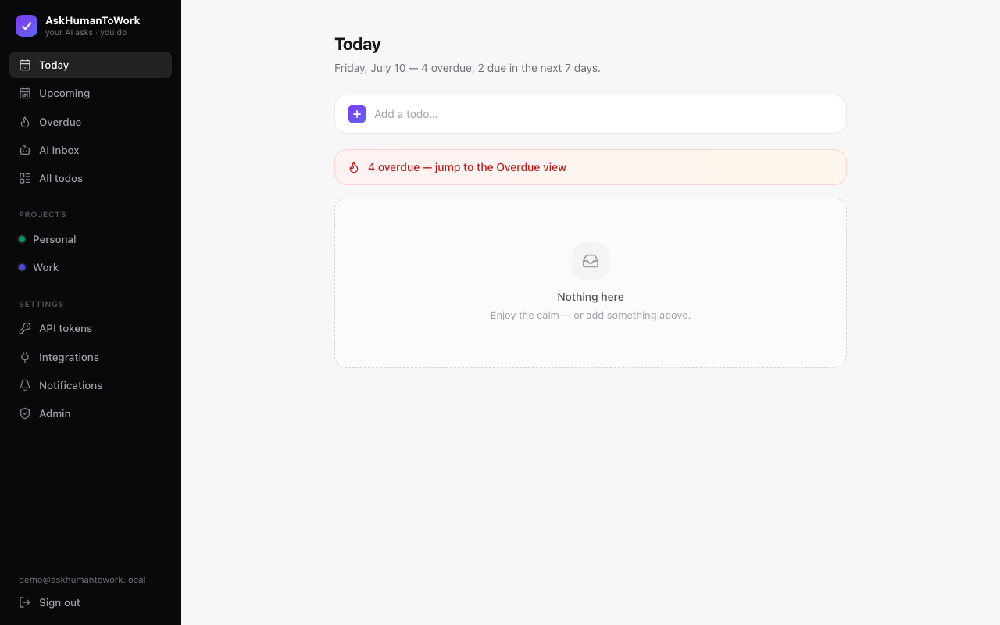
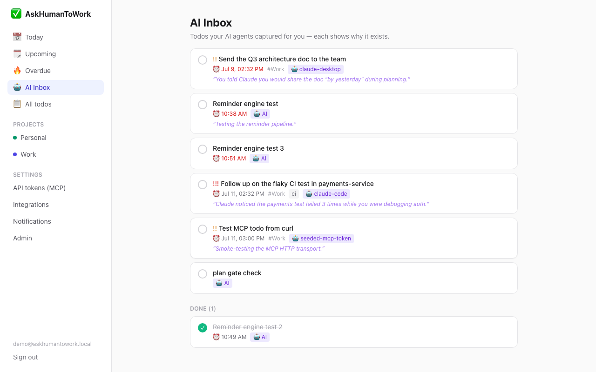
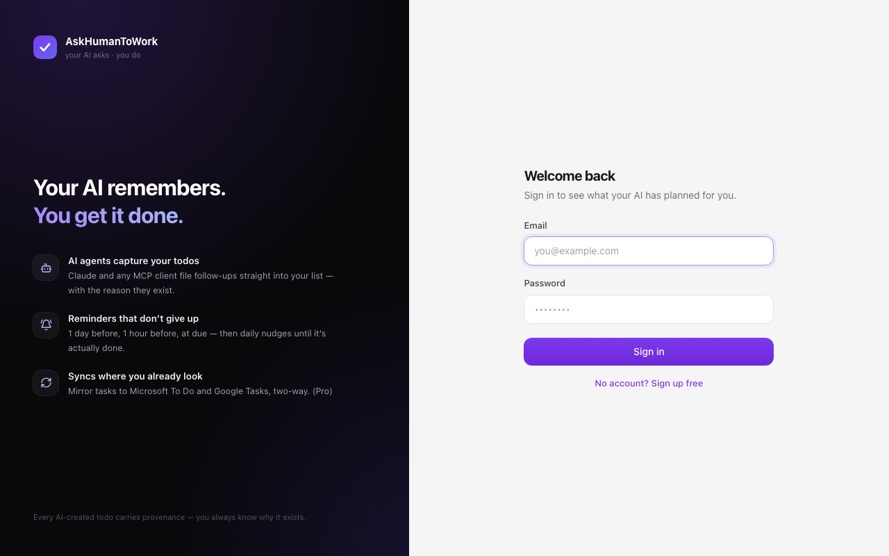
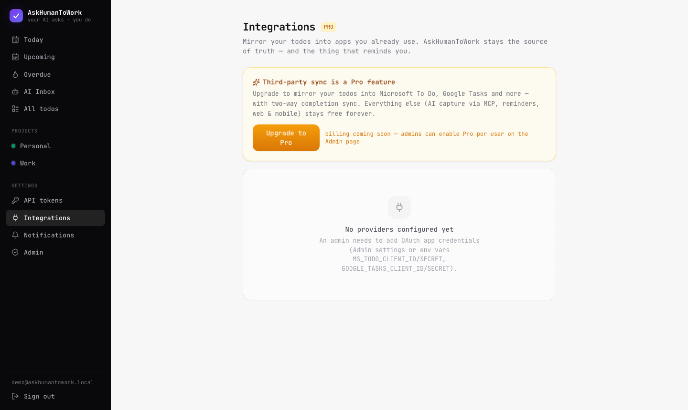

# AskHumanToWork

**The todo hub where your AI asks *you* to work.**

AI agents (Claude Desktop, Claude Code, any MCP client) capture todos into your list — with due
dates and *provenance* ("why this exists") — and AskHumanToWork **reliably reminds you until they're
done**. Optionally (Pro), todos mirror out to Microsoft To Do / Google Tasks so they appear where
you already look.



## Why

Heavy AI users generate implicit todos constantly: *"you should follow up on X"*, *"remember to
deploy Y on Friday"*. Those evaporate in chat history. AskHumanToWork captures them at the source —
the AI conversation itself — and closes the loop with an escalating reminder engine.

Every AI-created todo shows **who** added it and **why**:





---

# Tutorial — zero to your first AI-captured todo

## 0. Prerequisites

- Node ≥ 20 and [pnpm](https://pnpm.io) (`npm i -g pnpm`)
- PostgreSQL 16 and [Mailpit](https://mailpit.axllent.org) (local email catcher)
- Flutter 3.x (only for the mobile app)

macOS one-liner for the services:

```bash
brew install postgresql@16 mailpit
brew services start postgresql@16 mailpit
createdb askhumantowork
```

(Prefer containers? `docker compose up -d` starts the same services.)

## 1. Install & configure

```bash
git clone https://github.com/KuronokiCorp/AskHumanToWork.git && cd AskHumanToWork
pnpm install

cp .env.example .env
# In .env, set:
#   ENCRYPTION_KEY  → run: openssl rand -base64 32
#   VAPID keys      → run: npx web-push generate-vapid-keys   (for browser push; optional)
```

## 2. Build, migrate, seed

```bash
pnpm build
pnpm db:migrate
pnpm db:seed
```

The seed prints your demo credentials — **copy the MCP token now**, it's stored only as a hash:

```
Seeded demo data.
  Login:     demo@askhumantowork.local / demo1234
  MCP token: tfa_XXXXXXXXXXXXXXXXXXXXXXXX
```

## 3. Run it (3 terminals)

```bash
pnpm dev:api                                    # API on :3000, MCP endpoint at /mcp
pnpm --filter @askhumantowork/api dev:worker    # reminder + sync engine
pnpm dev:web                                    # web app on :5173
```

Open http://localhost:5173 and sign in with the demo account. You'll see seeded todos, including
AI-captured ones in the **AI Inbox**.

## 4. Add your first todo (human style)

In the quick-add box, natural language just works:

```
Ship the release notes @friday 5pm #Work !2
```

`@…` = due date (resolved in *your* timezone, server-side) · `#…` = project (auto-created) ·
`!1-3` = priority.

## 5. Connect Claude — the main event

```bash
claude mcp add heyhuman \
  --env TODO_API_TOKEN=tfa_your_token_here \
  -- npx -y heyhuman-mcp
```

That's the whole setup — just a token. The connector is a thin HTTP client that defaults to the
hosted API (`https://askhumantowork--askhumantowork.asia-east1.hosted.app`); **no local server or
database required**. Point it elsewhere with `--env TODO_API_URL=...` if you self-host. Claude
Desktop users: see the equivalent JSON config in [`packages/mcp/README.md`](packages/mcp/README.md).

Now, in any Claude session:

> **You:** remind me to review the auth PR tomorrow at 3pm
>
> **Claude:** *(calls `add_todo` with `due_natural: "tomorrow 3pm"` and
> `origin_context: "You asked while we were discussing the auth refactor."`)*
> Added — it'll remind you tomorrow at 2pm and 3pm. → http://localhost:5173/t/…

Refresh the **AI Inbox** — the todo is there, with Claude's name and the reason it exists.

Also try:
- *"what's on my plate today?"* → Claude calls `get_agenda`
- *"I finished the auth PR"* → `complete_todo` (reminders cancelled)
- The `/capture-followups` prompt → Claude scans the whole conversation and files every commitment
  as a todo.

### Session briefing — agents pick up where things left off ⭐

Every agent session starts with `get_briefing`: the server diffs your list against **that token's
previous check-in** and hands the agent everything it needs to continue the work instead of
starting cold:

- **Completed since last session** — the agent sees what you finished and acknowledges progress
  instead of re-suggesting it.
- **Blocked, with reasons** — todos marked `status: blocked` (e.g. *"waiting for App Review"*)
  are surfaced every session until unblocked, so nothing silently stalls. Agents can set and
  clear this themselves via `update_todo`.
- **Newly added & overdue** — what appeared while the agent was away, and what slipped.
- **`nextSteps`** — the open todos ranked by urgency: the recommended order to start working.

No extra bookkeeping: the "since" marker is simply the token's `lastUsedAt`, so each agent gets
its own personal diff automatically.

## 6. Watch a reminder fire

Reminders ladder automatically: **1 day before → 1 hour before → at due → daily overdue nudges**.
To see one in 20 seconds:

```bash
curl -X POST http://localhost:3000/api/todos \
  -H "Authorization: Bearer tfa_your_token" -H "Content-Type: application/json" \
  -d '{"title":"Reminder demo","dueNatural":"in 10 minutes","reminders":["in 20 seconds"]}'
```

Open the Mailpit UI at http://localhost:8025 — the reminder email arrives, including the AI
provenance if an agent created the todo. (Enable browser push in Settings → Notifications for
native notifications; quiet hours are respected.)

## 7. Mobile app — HeyHuman (Flutter)

The mobile app ships as **HeyHuman** ("Your AI remembers. You get it done.") — every notification
reads as your AI addressing you.

```bash
cd mobile && flutter run          # iOS simulator or Android emulator
```

Sign in with the demo account. Same Today/Upcoming/Projects/AI Inbox views plus search and settings;
server reminders are mirrored as local notifications; completing a todo on the phone syncs back instantly.

## 8. Mirror to Microsoft To Do / Google Tasks (Pro)

Third-party sync is a **Pro-plan feature**. As the seeded admin you're already Pro; upgrade other
users on **Settings → Admin**.



1. Register an OAuth app —
   **Microsoft:** Azure Portal → App registrations, delegated `Tasks.ReadWrite` + `offline_access`,
   redirect URI `http://localhost:3000/api/integrations/ms-todo/callback` ·
   **Google:** Cloud Console → OAuth credentials, scope `https://www.googleapis.com/auth/tasks`,
   redirect URI `http://localhost:3000/api/integrations/google-tasks/callback`
2. Paste client id/secret in **Settings → Admin** (or the `.env` vars).
3. **Settings → Integrations → Connect**, pick a target list, direction (two-way / outbound),
   and filters (AI-only, priority threshold).

AskHumanToWork stays the source of truth: mirrors degrade per provider capability (Google Tasks has
date-only due dates and no reminders — our reminder engine still covers you), and completing a task
*in* the external app completes it here and cancels the reminders (2-minute polling).

---

# Reference

## Architecture

```
AI agents ──MCP (stdio / HTTP)──►┐
Web (React) ──REST──────────────►│  Fastify API ──► PostgreSQL (source of truth)
Flutter app ──REST──────────────►┘       │
                                         ├─► pg-boss (Postgres): reminder ladder + sync outbox
                                         ├─► Email (SMTP) + Web Push reminders
                                         └─► Adapters: Microsoft To Do, Google Tasks (Pro)
```

| Package | What |
|---|---|
| `packages/shared` | zod schemas, enums, server-side natural-language date resolution |
| `packages/db` | Drizzle ORM schema, migrations, seed |
| `packages/core` | domain services, entitlements, sync engine, provider adapters |
| `packages/api` | Fastify REST API, auth, `/mcp` HTTP transport, background workers |
| `packages/mcp` | `heyhuman-mcp` — publishable stdio MCP connector |
| `packages/web` | React web app (Vite + Tailwind + TanStack Query) |
| `mobile/` | Flutter app (Riverpod + dio + local notifications) |

## MCP surface

**Tools:** `get_briefing` (session-start diff: completed/added since last check-in, blocked with
reasons, ranked next steps) · `add_todo` (natural dates, `origin_context` provenance, idempotent,
`sync_to` routing) · `list_todos` · `search_todos` · `update_todo` (incl. `blocked` +
`blocked_reason`) · `complete_todo` · `reschedule_todo` · `get_agenda` · `list_projects` ·
`list_integrations` · `resolve_time`

**Resources:** `todo://agenda/today` · `todo://agenda/overdue` · `todo://projects`
**Prompts:** `capture-followups` · `review-my-todos`

Remote clients can skip the local install entirely: Streamable HTTP MCP at `POST <server>/mcp`
with `Authorization: Bearer <token>`.

## Auth model

Web = cookie sessions. Mobile = long-lived device tokens (`POST /api/auth/login` with
`mode:"token"`). AI agents = scoped Personal Access Tokens (`todos:read/write`, `projects:read`,
`integrations:read`) created in Settings → API tokens.

PATs can additionally be **project-scoped**: pick a project (or create one inline) when minting
the token, and that token only sees/edits todos in its project plus ones it created itself —
give each agent its own sandbox. Tokens without a project (“Admin — full access”) and web
sessions see everything; device tokens are always full-access.

## Plans

Everything is free except third-party sync (Pro). Gating is enforced server-side (connect → HTTP
402, no outbound fan-out, inbound pollers skip). Until billing ships, admins set plans on the
Admin page.

## Deploying

Single-image deploy — the API container also serves the built web app (`SERVE_WEB=true`) and runs
migrations on start; a second container from the same image runs the reminder/sync worker:

```bash
cp .env.example .env      # set SESSION_SECRET + ENCRYPTION_KEY (+ VAPID keys)
docker compose --profile app up -d --build
# → http://localhost:3000 (web + API + MCP), worker running, Postgres/Mailpit included
```

For a real host (Fly.io / Railway / a VPS): build the `Dockerfile`, provide `DATABASE_URL`,
SMTP credentials, and set `COOKIE_SECURE=true` + `TRUST_PROXY=true` behind HTTPS.
Sessions and the job queue live in Postgres (pg-boss), so multiple API instances are safe and no Redis is needed.

## Publishing the npm connector

```bash
cd packages/mcp && npm login && pnpm publish
```

Ships only `dist/` with two runtime deps; `prepublishOnly` builds automatically.

## Tests

```bash
pnpm typecheck && pnpm test        # TS packages (incl. date-resolution unit tests)
cd packages/web && pnpm test:e2e   # Playwright: landing + agenda + tokens (boots API on askhumantowork_e2e)
cd mobile && flutter analyze       # Flutter
```

Core integration tests (dedup, recurrence, reminders, plan gating) run against real Postgres — locally `createdb askhumantowork_test` first. A scripted end-to-end regression (auth, todos, dedup, agenda, MCP both transports, reminder
delivery/cancellation, plan gating) lives in the `feature-tester` agent charter at
`.claude/agents/feature-tester.md` — Claude Code users can run it with "run the feature-tester".

## Support

If AskHumanToWork saves you some follow-ups, you can buy me a coffee:

[](https://buymeacoffee.com/kuronoki)


## Roadmap

Recurring todos · edit-in-place UI · web search & tag filters · notification action buttons ·
FCM/APNs mobile push · morning AI digest · Graph webhooks (realtime inbound) · Todoist adapter ·
Stripe billing · cloud deploy.
